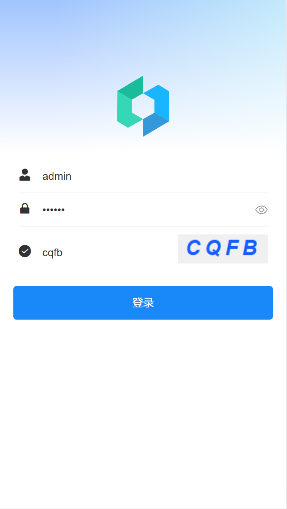
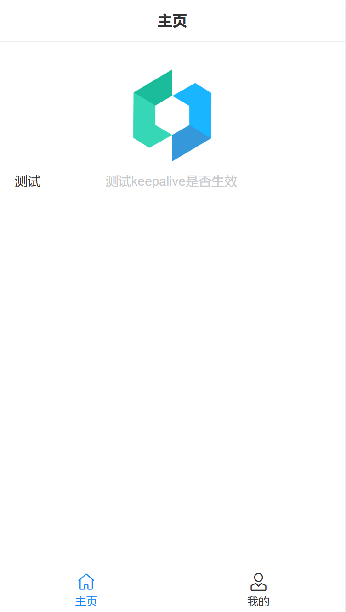
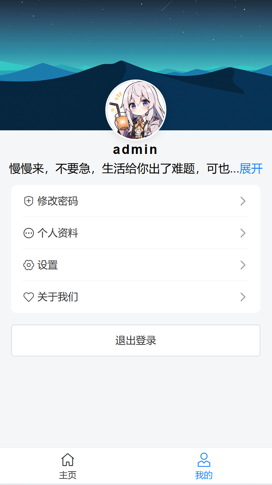
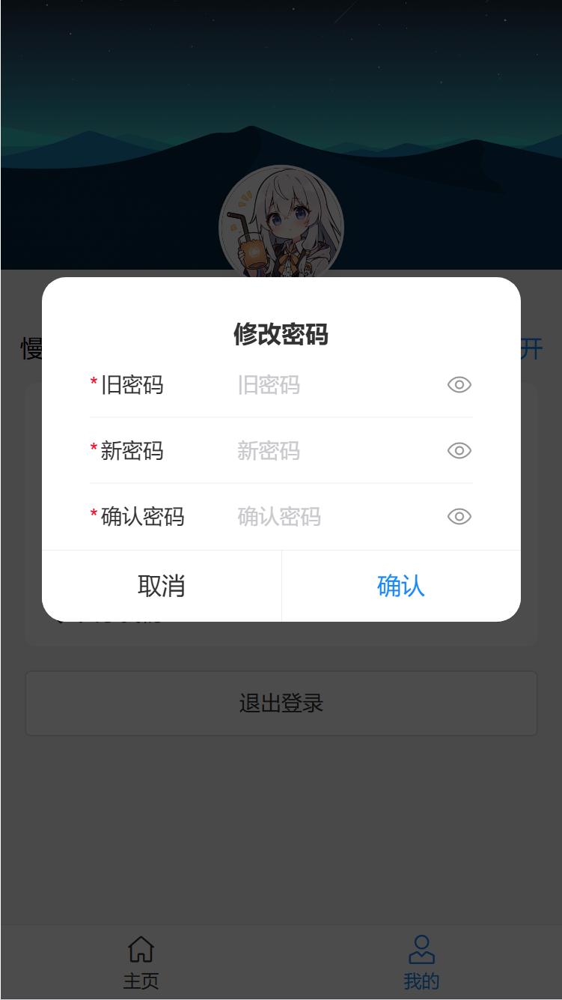
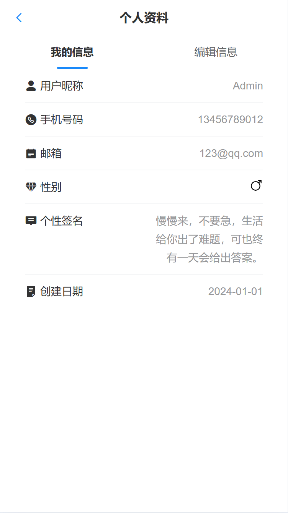
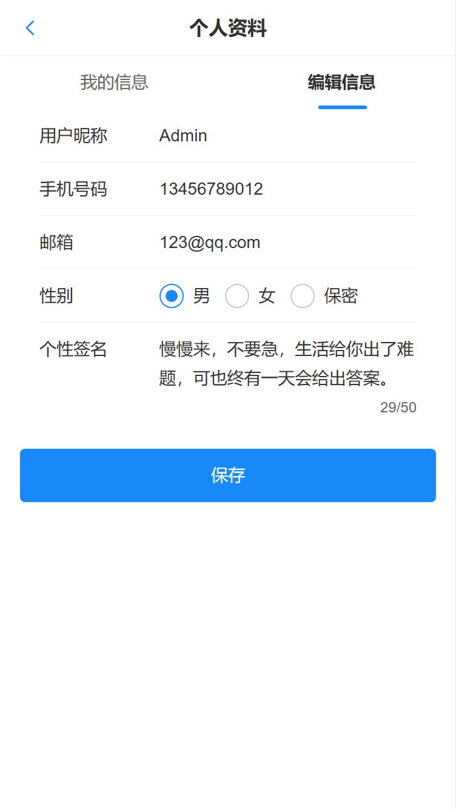

<p align="center">
	
</p>
<h1 align="center" style="margin: 30px 0 30px; font-weight: bold;">Vue3-Vant-Template</h1>
<h4 align="center">
基于Vue3+Vant4的移动端H5模板【没有TS😋】
</h4>

## 使用

```sh
# 安装依赖
npm install

# 运行
npm run dev

# 打包
npm run build

# 预览
npm run preview
```

## 效果图

<table>
	<tr>
		<td>
			
		</td>
		<td>
			
		</td>
	</tr>
	<tr>
		<td>
			
		</td>
		<td>
            
    	</td>
  	</tr>
    <tr>
		<td>
			
		</td>
		<td>
            
    	</td>
  	</tr>
</table>


## 鸣谢
- [Vue3 h5 template](https://github.com/yulimchen/vue3-h5-template)
- [RuoYi-Vue3](https://github.com/yangzongzhuan/RuoYi-Vue3)
- [vue-admin-template](https://github.com/PanJiaChen/vue-admin-template)
